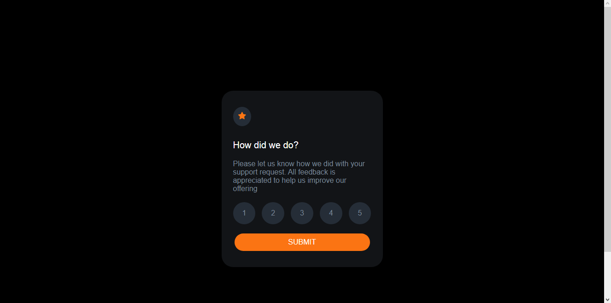
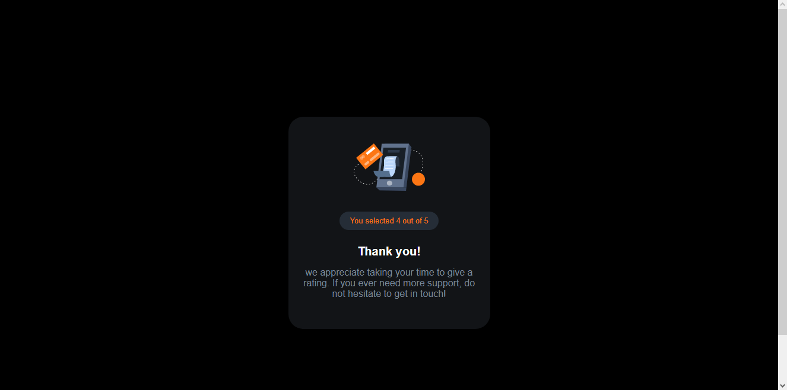

# Frontend Mentor - Interactive rating component solution

This is a solution to the [Interactive rating component challenge on Frontend Mentor](https://www.frontendmentor.io/challenges/interactive-rating-component-koxpeBUmI). Frontend Mentor challenges help you improve your coding skills by building realistic projects. 

## Table of contents

- [Overview](#overview)
  - [The challenge](#the-challenge)
  - [Screenshot](#screenshot)
- [My process](#my-process)
  - [Built with](#built-with)
  - [Continued development](#continued-development)
- [Author](#author)
- [Acknowledgments](#acknowledgments)

## Overview

### The challenge

Users should be able to:

- View the optimal layout for the app depending on their device's screen size
- See hover states for all interactive elements on the page
- Select and submit a number rating
- See the "Thank you" card state after submitting a rating

### Screenshot

## My process
- put everything in a flex container
- set container max-width
- set same container in another file
- set hover effect and active
- add event listener to add 'active' class and redirect page

### Built with

- Semantic HTML5 markup
- CSS custom properties
- Flexbox

### Continued development

- Designing with CSS
- Javascript

## Author

- Frontend Mentor - [@mykexie](https://www.frontendmentor.io/profile/mykexie)

## Acknowledgments

Appreciate Frontendmentor.io for the style-guide and sample design.
